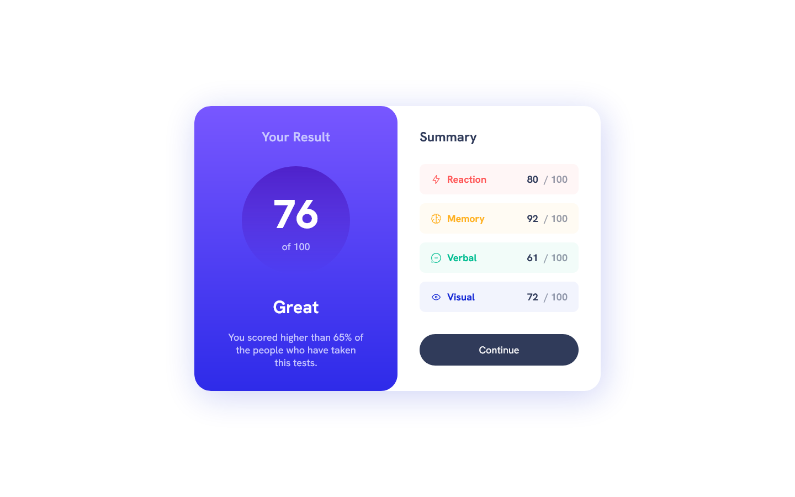

# Frontend Mentor - Results summary component solution

This is a solution to the [Results summary component challenge on Frontend Mentor](https://www.frontendmentor.io/challenges/results-summary-component-CE_K6s0maV). Frontend Mentor challenges help you improve your coding skills by building realistic projects.

## Table of contents

- [Frontend Mentor - Results summary component solution](#frontend-mentor---results-summary-component-solution)
  - [Table of contents](#table-of-contents)
  - [Overview](#overview)
    - [The challenge](#the-challenge)
    - [Screenshot](#screenshot)
    - [Links](#links)
  - [My process](#my-process)
    - [Built with](#built-with)
  - [Author](#author)

**Note: Delete this note and update the table of contents based on what sections you keep.**

## Overview

### The challenge

Users should be able to:

- View the optimal layout for the interface depending on their device's screen size
- See hover and focus states for all interactive elements on the page

### Screenshot

### Links

- Solution URL: (https://your-solution-url.com)
- Live Site URL: (https://fem-results-summary-component8.netlify.app/)

## My process

### Built with

- Semantic HTML5 markup
- SASS/SCSS
- Flexbox
- CSS Grid
- Mobile-first workflow
- NPM Package dev dependency: sass, live-server, npm-run-all.

I used a simple NPM environment setup to run the SASS/SCSS bundler during development. After finishing the development process, I simply copied the entire project folder to the same directory, renamed it, and deleted the 'node_modules' folder. Then, I manually uploaded the complete project folder (without 'node_modules') to Netlify.

## Author

- Frontend Mentor - [Agus Siswanto](https://www.frontendmentor.io/profile/siswantodev)
